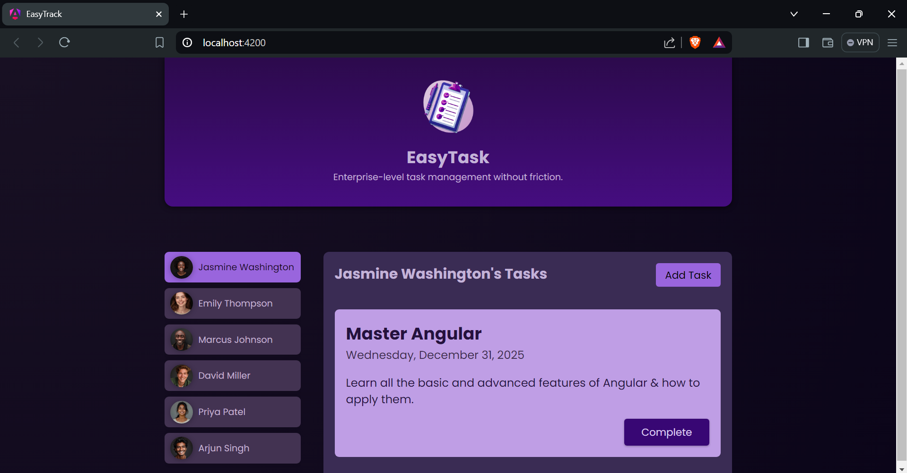
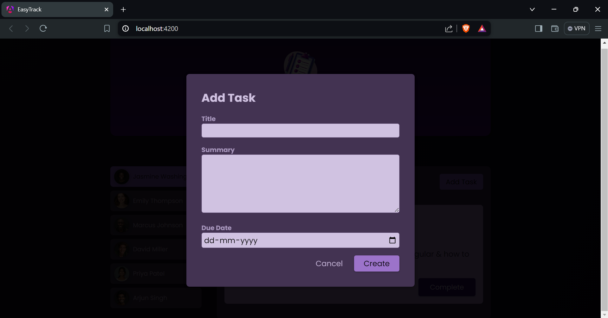

# EasyTrack - Enterprise Task Management

EasyTrack is an enterprise-level task management application built with Angular. This application allows users to manage their tasks efficiently with a clean and intuitive user interface. The project demonstrates the use of Angular components, services, and modules to create a dynamic and responsive task management system.

## Table of Contents

- [Features](#features)
- [Screenshots](#screenshots)
- [Getting Started](#getting-started)
- [Prerequisites](#prerequisites)
- [Installation](#installation)
- [Running the Application](#running-the-application)
- [Usage](#usage)
- [Contributing](#contributing)

## Features

- **User Selection:** Allows selecting different users to view their tasks.
- **Task Management:** Add, view, and delete tasks.
- **Responsive Design:** Optimized for both desktop and mobile views.
- **Persistent Storage:** Tasks are saved in the localStorage for persistence.

## Screenshots

### Main Interface


### Task Details


## Getting Started

These instructions will get you a copy of the project up and running on your local machine for development and testing purposes.

### Prerequisites

Make sure you have the following installed:

- [Node.js](https://nodejs.org/) (v14.x or higher)
- [Angular CLI](https://angular.io/cli) (v12.x or higher)

### Installation

1. **Clone the repository:**

    ```bash
    git clone https://github.com/sakethyalamanchili/EasyTrack.git
    cd easytrack
    ```

2. **Install dependencies:**

    ```bash
    npm install
    ```

### Running the Application

1. **Start the development server:**

    ```bash
    ng serve
    ```

2. **Open your browser and navigate to:**

    ```
    http://localhost:4200
    ```


## Usage

1. **Header Component:**
    - Displays the application logo and title.
    - Provides a brief description of the app.
    
2. **User Component:**
    - Lists all users with their avatars.
    - Allows selecting a user to view their tasks.

3. **Tasks Component:**
    - Displays tasks for the selected user.
    - Provides options to add new tasks or delete existing ones.

4. **New Task Component:**
    - Form to create a new task.
    - Includes fields for title, summary, and due date.

5. **Task Component:**
    - Displays individual task details.
    - Option to mark tasks as complete and remove them.

## Contributing

Contributions are welcome! Please follow these steps to contribute:

1. Fork the repository
2. Create a new branch (`git checkout -b feature/your-feature-name`)
3. Make your changes
4. Commit your changes (`git commit -am 'Add new feature'`)
5. Push to the branch (`git push origin feature/your-feature-name`)
6. Create a new Pull Request
